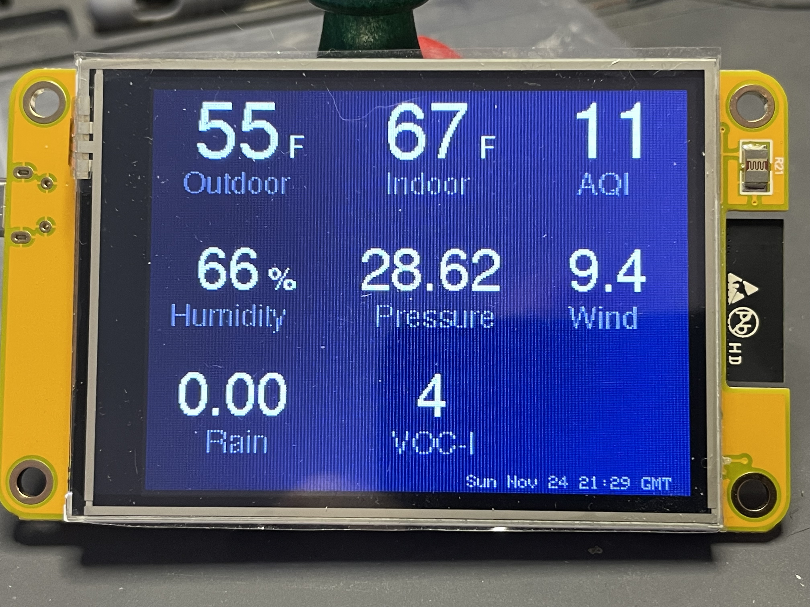

# Weather Information Aggregator

Recently I was introduced to the ESP32-2432S028R as a potential development platform.  Admittedly, that's not a great (or easy to remember) name and I honestly don't know who designed it, but the board has a lot going for it -- ESP32 with WiFi and Bluetooth, 320x240 2.8" TFT display, resistive touchscreen, USB for power and programming, SD card slot, and accessible GPIO for I2C with a few left over.  It's available from multiple sources for $15-$19 USD, so not especially expensive.

Folks with more history here, like [@witnessmenow](https://github.com/witnessmenow), [randomnerdtutorials.com](https://randomnerdtutorials.com/), and [@ericklein](https://github.com/ericklein/powered_air_quality), have taken to calling the board "Cheap Yellow Display" or "CYD" for lack of a better name and given the circuit board underneath is bright yellow.  Alas, part of the mystery of this board is that there's just no good official documentation anywhere. To address that @witnessmenow has assembled an extensive collection of info and example software, which I found exceptionally useful and you'll find [here](https://github.com/witnessmenow/ESP32-Cheap-Yellow-Display).

I find it both helpful and fun to approach a new board with a useful project that explores its capabilities, so here's my first effort for CYD.  It takes advantage of the fact that all my network-connected IoT projects make use of [Dweet.io](https://dweet.io) as a simple but effective publish-and-subscribe messaging platform. CYD makes a great aggregation platform for gathering and displaying relevant data from those varied sources, in particular data related to the current weather and air quality conditions at my home. At the moment the two sources supported are my [Home Weather Station](https://github.com/disquisitioner/Weather-Station) (WX) and [Air Quality Monitor](https://github.com/disquisitioner/AQI-Monitor-SEN54) (AQ), hence the name: `wxaq_cyd`.

I don't expect this project will be directly useful to anyone else, given it depends on understanding the data schema and dweet.io publishing format my IoT devices use, but the overall structure and some of the specific aspects might be of interest (like using built-in HTTP client support and the marvelous ArduinoJson library to fetch and parse data from a web service).